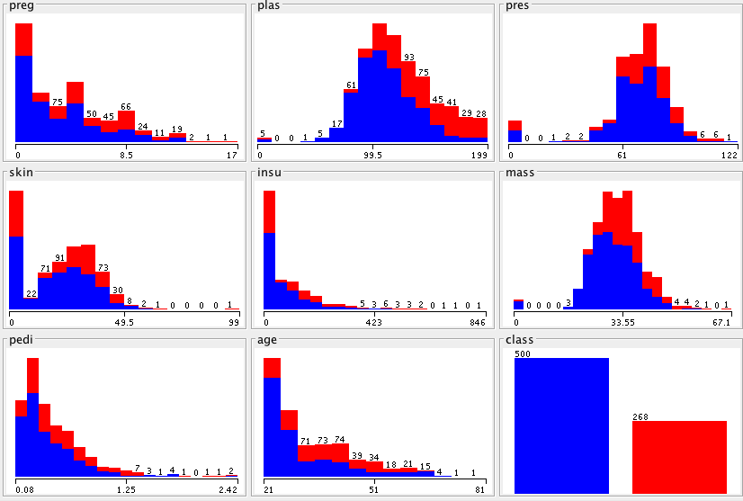
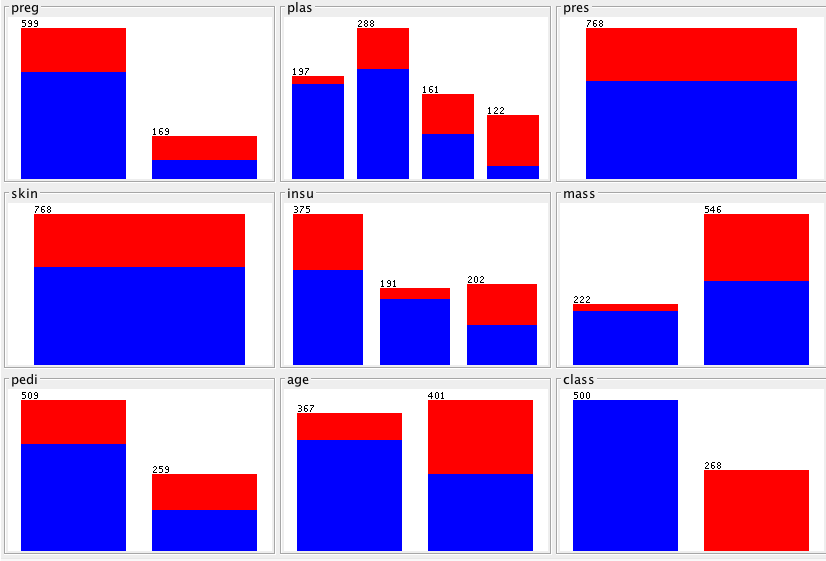

[home](http://tiny.cc/fss2016) | [copyright](https://github.com/txt/fss16/blob/master/LICENSE.md) &copy;2016, tim&commat;menzies.us<br>
[](http://tiny.cc/fss2016)   <br>
[overview](https://github.com/txt/fss16/blob/master/doc/overview.md) |
[syllabus](https://github.com/txt/fss16/blob/master/doc/syllabus.md) |
[src](https://github.com/txt/fss16/blob/master/src) |
[submit](http://tiny.cc/fss2016give) |
[chat](https://fss16.slack.com/) 

_______

# Discretization

Pre-processing of numerics. Also, half way to an explanation facility.

- Not every learning can handle numerics
- Not every learning can handle numerics very well
- Discretization: convert numbers to a finite number of bins.
- Simple schemes (like nbins), are surprisingly effective (see [Dougherty95]("http://robotics.stanford.edu/users/sahami/papers-dir/disc.pdf).
- E.g. really helps for NaiveBayes.

Two kinds of discretization (from Dougherty95 ): Supervised and Unsupervised


## Unsupervised Discretization

Ignores class symbols

- e.g. EID: EqualIntervalDiscretization (Nbins)
- e.g. EFD: EqualFrequencyDiscretization (a.k.a. HistogramDiscretization or PercentileChop):

Nbins: divide according to (max-min)/N; often N=5,7,10

   - So the frequency counts in each bin may be unequal (bumpy histogram).
   - e.g. divide 0,0,0,0,0,0,0,0,1,1,1,1,1,1,1,2,2,2,2,3,4,5,10,20,40,80,100 using 10bins
   
        0,0,0,0,0,0,0,0,1,1,1,1,1,1,1,2,2,2,2,3,4,5,10,20,40,80,100
        -------------------------------------------|--|--|--|--|---|
        bin1                                        b2 b3 b5 b9 b10
        
   - one bucket would get numbers 1 to 25,
   - the last 4 numbers would get a bin each.
   - So our learner would have 5 bins with nothing in it, one bin with 83% of the data and
4 bins with 3.3% of the data in each.
   - Variants: _BinLogging_: set N via the number of unique numerics N=max(1,log2(uniqueValues))

EqualFrequencyDiscretization (a.k.a. HistogramDiscretization or PercentileChop):

- Keep the number of numbers in each division equal
- So the frequency counts in each bin is equal (flat histogram).
-  In practice, not quite flat. e.g. 10 equal frequency bins on the above data:


        0,0,0,0,0,0,0,0,1,1,1,1,1,1,1,2,2,2,2,3,4,5,10,20,40,80,100
        -----|----|-----|-----|-----|-----|-----|------|---------|
        bin1  bin2 bin3  bin4  bin5  bin6  bin7  bin8   bin9

- Note the buckets with repeated entries.
- Its a design choice what to do with those. We might squash them together such that there are no repeats in the numbers that are the boundaries between bins.

        0,0,0,0,0,0,0,0,1,1,1,1,1,1,1,2,2,2,2,3,4,5,10,20,40,80,100
        --------------|-------------|--------|----|-------|------- 
        bin1           bin2          bin3     bin4 bin5     bin6

## Supervised Discretization

Separates the numerics according to the class variable

- E.g. find a cliff where suddenly everything switches from one class to another
        - e.g. class=happy if age under 20; class=sad if age over 20
        - 20 is the cliff
- Best left to the learner

Some details on cliff learning (from https://list.scms.waikato.ac.nz/pipermail/wekalist/2004-October/002986.html. Per numeric attribute, apply the following:

- Sort the instances on the attribute of interest
- Look for potential cut-points.
     - Cut points are points in the sorted list above where the class labels change.
     - Eg. if I had five instances with values for the attribute of interest and labels
     - (1.0,A), (1.4,A), (1.7, A), (2.0,B), (3.0, B), (7.0, A),
     - then there are two cut points of interest (mid-way between the points where the classes change from A to B or vice versa) i.e.  1.85 or 5
- Apply your favorite measure on each of the cuts, and choose the one with the maximum value
     - e.g. info gain, gain ratio, gini coefficient, chi-squared test.
     - Common practice is to follow the lead of Fayyad&Irani and use info gain
- Repeat recursively in both subsets (the ones less than and greater than the cut point) until either
     - the subset is "pure" i.e. only contains instances of a single class
     - some stopping criterion is reached. e.g. too few examples to proceed

Example, FayyadIrani discretizer (widely used). Splits on InfoGain

**BEFORE:**



**AFTER:**



## Incremental Discretization


An interesting variant on discretization is incremental discretization.
Suppose we are learning from an infinite data stream so we'll never know
"the number of unique symbols" or the "max" and "min" of that data. How
might we conduct discretization?

Gama and and Pinto's Partition Incremental Discretization
[(PiD)](http://citeseerx.ist.psu.edu/viewdoc/download?doi=10.1.1.123.6872&rep=rep1&type=pdf) maintains two sets of
"break" points and "counts" of values that fall into each break:

-   Layer two: the actual discretized ranges. Layer two is very small
    and is generated on demand from layer one.
-   Layer one: is very large (say, 30 times the number of bins you
    seek); Layer one just maintains counts on a large number of bins and
    if one bin gets too big (e.g. 1/(number of bins)), it is split in
    two (and all the breaks and counts arrays are pushed up by one index
    value).

That's nearly all there is too it. Layer one is initialized according to
some wild guess about the min and max possible values (and if data
arrives outside that range, then a new bin is added bottom or two of
"breaks" and "counts"). Layer two could be generated in any number of
ways (nbins, logbins, FayyadIranni, etc) and those methods could work by
querying the layer one data.

When should we recreate layer2? Here are three policies:

-   For equal width discretization: if ever we split a bin, rebuild
    layer2.
-   For equal frequency discretization: if a layer1 bin gets two large,
    rebuild layer2. If we have seen "n" examples, and our bins have min
    and max counts of "cmin" and "cmax" then rebuild layer2 when we see
    an interval with:
    -   count below (1-&alpha;)\*cmin/n or
    -   count above (1+&alpha;)\*cmax/n

    Gama and Pinto comment that &alpha;=1/100 seems to be a useful value.
-   For other discretization policies, recreate layer2 after seeing N
    examples (say, N=100).

Here's the pseudo-code for updating layer1. Its a little tacky (a linear
time operation to increase the size of an array) but it runs so fast
than no one cares:

```
    Update-Layer1(x, breaks, counts, NrB, alfa, Nr) 
      x - observed value of the random variable 
      breaks - vector of actual set of break points 
      counts - vector of actual set of frequency counts 
      NrB - Actual number of breaks 
      alfa - threshold for Split an interval 
      Nr - Number of observed values 

    If (x < breaks[1]) k = 1; Min.x = x 
    Else If (x > breaks[NrB] k = NrB; Max.x = x 
    Else k = 2 + integer((x - breaks[1]) / step) 

    while(x < breaks[k-1]) k <- k - 1 
    while(x > breaks[k]) k <- k + 1 

    counts[k] = 1 + counts[k] 
    Nr = 1 + Nr 
    If ((1+counts[k])/(Nr+2) > alfa) { 
      val = counts[k] / 2            
      counts[k] = val 
      if (k == 1) { 
         breaks = append(breaks[1]-step, breaks) 
         counts <- append(val,counts) 
      } 
      else { 
         if(k == NrB) { 
            breaks <- append(breaks, breaks[NrB]+step) 
            counts <- append(counts,val) 
         } 
         else { 
            breaks <- Insert((breaks[k]+ breaks[k+1])/2, breaks, k) 
            counts <- Insert(val, counts, k) 
         } 
      }   
      NrB = NrB + 1 
  }
```
    
## Applications of Incremental Discretization: Anomaly Detection and Repair

Curiously, the literature is silent on two obvious applications of
incremental discretization:

-   Anomaly detection: if the discretization boundaries in an
    incremental discretizer where stable, then start changing, then
    something is happening to the data generating phenomena. Incremental
    discretizers could alert when old knowledge needs to be thrown out
    and new learning initiated.
-   Repair: if we could track how discretization ranges changed, then we
    could take old knowledge, patch its ranges, and test the fixes. If
    that happened incrementally with changes to the discretization
    boundaries, then we'd be keeping the knowledge up to date with the
    underlying data generating phenomena.

## Timm's rules for Discretization

Note: no proof these are good: just often useful.

Fuse numeric bins whose min and max values differences are _tiny_.

- Cohen's rule : small effect if (max - min) less that less than 30\% of standard deviation

     
Only show users _sharp_ and _relevant_ ranges:

- Some numeric attributes are _blunt_; i.e. when we descritize, we only get one range.
        - e.g. in the above, _pres,skin_
- While other numbers are _sharp_; i.e. not blunt
- Some ranges are _relevant_: are associated with the `goal` class (e.g. defective class)
        - e.g., in the above, if red is the goal, don't mention anything were red in the minority:
        - so only high values of preg, plas, maybe age


Applications to clustering

- Cluster, mark each cluster class1,class2, etc
- Apply Fayyad Irrani
- Apply the above rules to show very few parts of very few clusters.

Only show ranges that change the target class distribution

- i.e. apply FayyadIrani
- BTW, when implementing FayyadIrani,
     - sort data only once they keep the sort order
       in all recursive parts
     - At each level of the recursion, run _once_ over the numbers to learn _all_ the stats. Then run _twice_ from left to right, incrementally accumulating to _left_ while incrementally decrementing to the _right_ (saves multiple passes, but needs an `add` and a `sub` on `Num` class)
     - Do not create _tiny_ bins
     - Set a minimum _enough_ size for a bin (same, sqrt of the data).
     - Only recursively divide if the expected value of variability after the split is less
       than before.
     - Before recursion, check the FayyadIrani information theory statistic.


In the following, how many of the above rules can you find:

```python
def relevant(tbl, goal):
  "Only returns a range if it contains the goal."
  for pos,ranges in sharp(tbl):
    for range in ranges:
      if range.report.mode == goal:
        yield pos,range

def sharp(tbl):
  "Only returns something is discretization can split the column."
  for col in tbl.cols:
    if isa(col.my,Num):
      ranges = div(div, label=col.txt,
                   x= lambda z: z[col.pos],
                   y= lambda z: z[tbl.klass[0].pos])
      if len(ranges) > 1:
        yield col.pos, ranges
        
def div(lst,label=0, x= same, y= same, yKlass= Num):
  def divide(lst, out=[], lvl=0, cut=None):  
    xlhs, xrhs   = Num() , Num(map(x,lst))
    ylhs, yrhs   = yKlass(), yKlass(map(y,lst))
    score,score1 = value(yrhs),None
    n            = len(lst)
    report       = copied(yrhs)
    for i,new in enumerate(lst):
      x1= x(new)
      y1= y(new)
      if not x1 == Thing.UNKNOWN:
        xlhs.add(x1); xrhs.sub(x1)
        ylhs.add(y1); yrhs.sub(y1)
        if xrhs.n < enough:
          break
        else:
          if xlhs.n >= enough:
            start, here, stop = x(lst[0]), x1, x(lst[-1])
            if here - start > tiny:
              if stop - here > tiny:
                score1 = ylhs.n/n*value(ylhs) + yrhs.n/n*value(yrhs)
                if score1*THE.divTrivial < score:
                  if yKlass == Num:
                    cut,score= i,score1
                  else:
                    k0,e0,ke0 = yrhs.k(), yrhs.ent(), ke(yrhs)
                    gain   = e0 - score1
                    delta  = math.log(3**k0-2,2)-(ke0- ke(yrhs)-ke(ylhs))
                    border = (math.log(n-1,2) + delta)/n
                    if gain >= border:
                      cut,score = i,score1
    if THE.divVerbose:
      print('.. '*lvl,len(lst),score1 or '.')
    if cut:
      divide(lst[:cut], out= out, lvl= lvl+1)
      divide(lst[cut:], out= out, lvl= lvl+1)
    else:
      out.append(Range(label=label, score=score, report=report,
                       n=len(lst), id=len(out),
                       lo=x(lst[0]), up=x(lst[-1]),
                       has=lst))
    return out
    # --- end function divide -----------------------------
  if not lst: return []
  ke     = lambda z: z.k()*z.ent()
  ent    = lambda z: z.ent()
  sd     = lambda z: z.sd()
  value  = sd if yKlass==Num else ent
  tiny   = THE.divTiny  or Num(map(x,lst)).sd() * THE.divCohen
  enough = THE.divEnough or len(lst)**0.5
  return divide( sorted(lst[:], key=x), out=[] ,lvl=0) # copied, sorted
```
